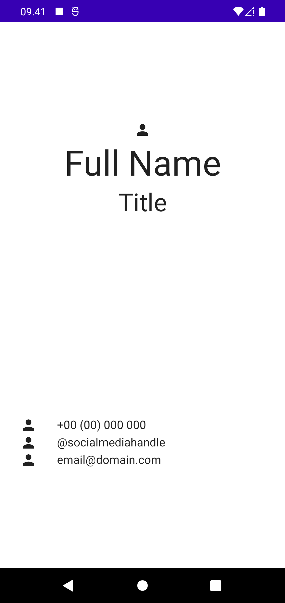

# Business Card Compose

This app is a practice of [basics compose codelab](https://developer.android.com/codelabs/basic-android-kotlin-compose-composables-practice-problems?continue=https%3A%2F%2Fdeveloper.android.com%2Fcourses%2Fpathways%2Fandroid-basics-compose-unit-1-pathway-3%23codelab-https%3A%2F%2Fdeveloper.android.com%2Fcodelabs%2Fbasic-android-kotlin-compose-composables-practice-problems) in this codelab I've learned about how to build UI with jetpack compose

Here is the result that I've implemented.
  

And here is the result expected.  

This look a much different because I don't have the asset to match as expected result but the structure of the layout that I've implemented with the result is the same.